---
## Front matter
title: "Отчёт по лабораторной работе №1"
subtitle: "Простейший вариант"
author: "Уткина Алина Дмитриевна"

## Generic otions
lang: ru-RU
toc-title: "Содержание"

## Bibliography
bibliography: bib/cite.bib
csl: pandoc/csl/gost-r-7-0-5-2008-numeric.csl

## Pdf output format
toc: true # Table of contents
toc-depth: 2
lof: true # List of figures
fontsize: 12pt
linestretch: 1.5
papersize: a4
documentclass: scrreprt
## I18n polyglossia
polyglossia-lang:
  name: russian
  options:
	- spelling=modern
	- babelshorthands=true
polyglossia-otherlangs:
  name: english
## I18n babel
babel-lang: russian
babel-otherlangs: english
## Fonts
mainfont: PT Serif
romanfont: PT Serif
sansfont: PT Sans
monofont: PT Mono
mainfontoptions: Ligatures=TeX
romanfontoptions: Ligatures=TeX
sansfontoptions: Ligatures=TeX,Scale=MatchLowercase
monofontoptions: Scale=MatchLowercase,Scale=0.9
## Biblatex
biblatex: true
biblio-style: "gost-numeric"
biblatexoptions:
  - parentracker=true
  - backend=biber
  - hyperref=auto
  - language=auto
  - autolang=other*
  - citestyle=gost-numeric
## Pandoc-crossref LaTeX customization
figureTitle: "Рис."
tableTitle: "Таблица"
listingTitle: "Листинг"
lofTitle: "Список иллюстраций"
lotTitle: "Список таблиц"
lolTitle: "Листинги"
## Misc options
indent: true
header-includes:
  - \usepackage{indentfirst}
  - \usepackage{float} # keep figures where there are in the text
  - \floatplacement{figure}{H} # keep figures where there are in the text
---

# Цель работы

Целью данной работы является приобретение практических навыков установки операционной системы на виртуальную машину, настройки минимально необходимых для дальнейшей работы сервисов.

# Выполнение лабораторной работы

## После установки

Войдем в уже установленную и настроенную операционную систему и откроем терминал. Переключимся на роль супер-пользователя для установки обновлений (sudo -i). 

### Обновления

Обновим все пакеты (рис. @fig:001).

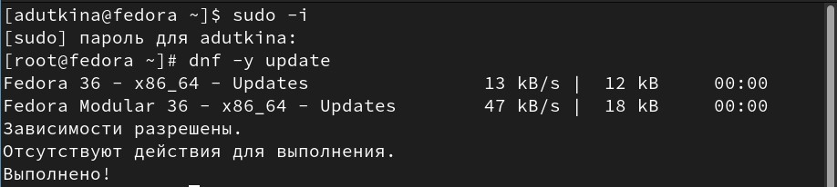{#fig:001 width=70%}

### Повешение комфорта работы

Установим программы для удобства работы в консоли (рис. @fig:002).

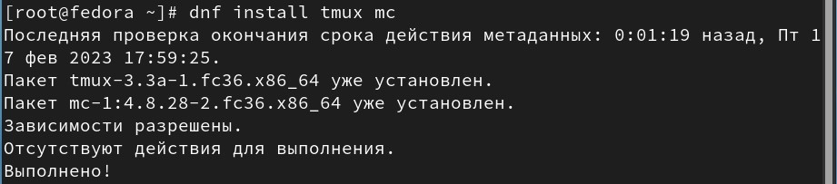{#fig:002 width=70%}

### Отключение SELinux

В данном курсе не рассматривается работа с системой безопасности SELinux, поэтому отключим его. Для этого в файле /etc/selinux/config замените значение SELINUX=enforcing на значение SELINUX=permissive (рис. @fig:003). Затем перегрузим виртуальную машину с помощью команды Reboot.

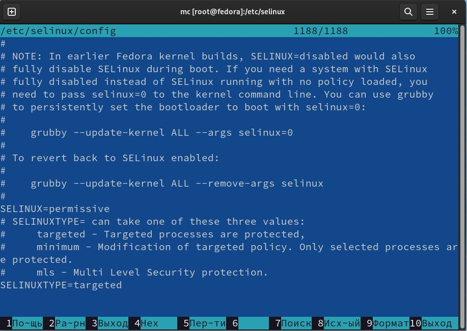{#fig:003 width=70%}

## Настройка раскладки клавиатуры

В терминале запустим мультиплексор tmux. В роли супер-пользователя отредактируем конфигурационный файл /etc/X11/xorg.conf.d/00-keyboard.conf с помощью файлового менеджера mc и его встроенного редактора (рис. @fig:004). Затем перезагрузим машину.

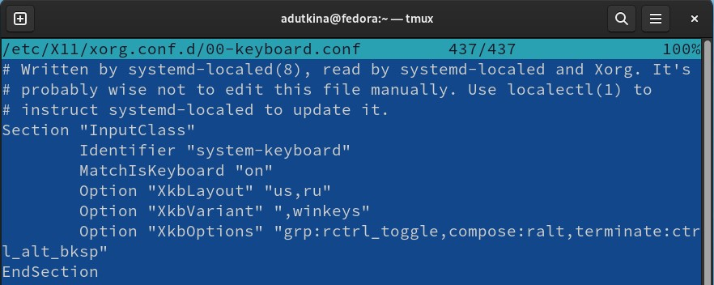{#fig:004 width=70%}

## Установка программного обеспечения для создания документации

В терминале в роли супер-пользователя запустим загрузку приложений pandoc и TeXlive (рис. @fig:005), (рис. @fig:006).

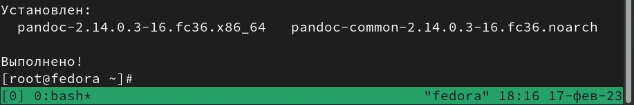{#fig:005 width=70%}

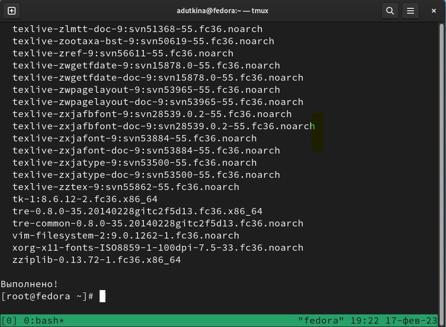{#fig:006 width=70%}

## Домашнее задание

Дождемся загрузки графического окружения и откроем терминал. Проанализируем последовательность загрузки системы, выполнив команду dmesg. (Можно просто просмотреть вывод этой команды: dmesg | less). Для поиска информации можно использовать grep: dmesg | grep -i "то, что ищем".

Получим следующую информацию:

1. Версия ядра Linux (рис. @fig:007): 
 
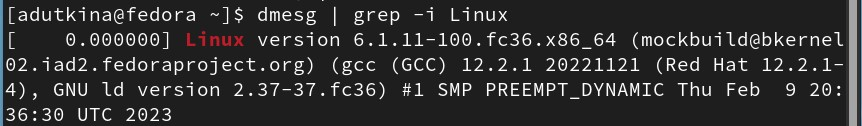{#fig:007 width=70%}

2. Частота процессора (рис. @fig:008).

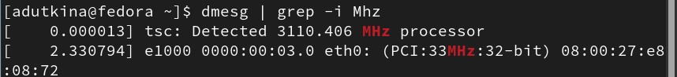{#fig:008 width=70%}

3. Модель процессора (рис. @fig:009).

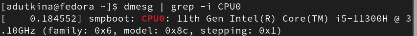{#fig:009 width=70%}

4. Объём доступной оперативной памяти (рис. @fig:010).

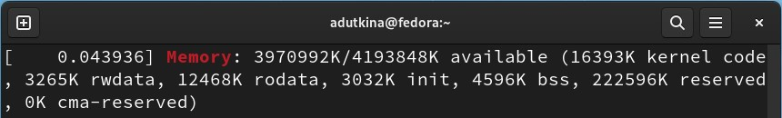{#fig:010 width=70%}

5. Тип обнаруженного гипервизора (рис. @fig:011).

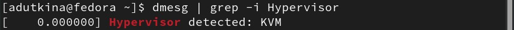{#fig:011 width=70%}

6. Тип файловой системы корневого раздела (рис. @fig:012).

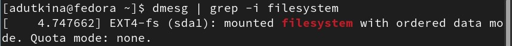{#fig:012 width=70%}

7. Последовательность монтирования файловых систем (рис. @fig:013).

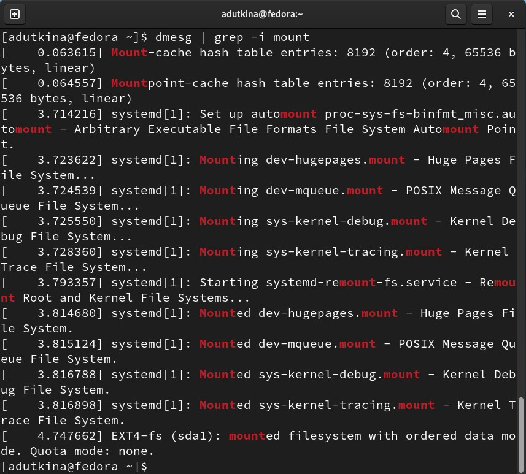{#fig:013 width=70%}

## Ответы на контрольные вопросы

1. Учетная запись пользователя содержит имя, пароль и активность учетной записи;

2. Примеры команд терминала: 

- для получения справки по команде используется --help (рис. @fig:014);

- для перемещения по файловой системе используется cd (рис. @fig:015);
	
- для просмотра содержимого каталога используется ls (рис. @fig:016); 

- для определения объёма каталога можно использовать команду du с ключем -sm (для отображения объема в мегабайтах) (рис. @fig:017);

- для создания каталогов используется mkdir (-p для создания каталога в каталоге), для создания файлов - touch, для удаления и каталогов, и файлов можно использовать rm (-r для рекурсивного удаления каталогов) (рис. @fig:018);

- для задания определённых прав на файл/каталог можно использовать команду chmod (для задания различных прав можно использовать значения в восьмиричной системе, например разрешить все права для пользователя (rwx) - 111 = 7) (рис. @fig:019);

- для просмотра истории команд используется history (рис. @fig:020).

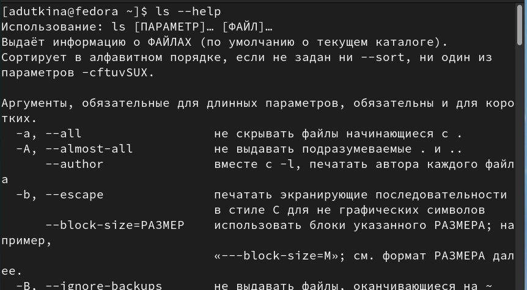{#fig:014 width=70%}

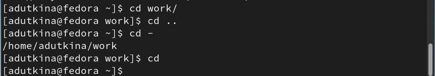{#fig:015 width=70%}

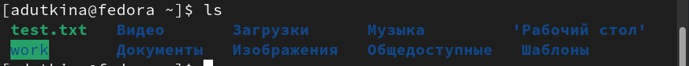{#fig:016 width=70%}

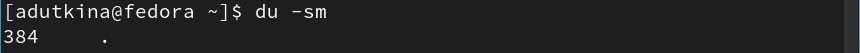{#fig:017 width=70%}

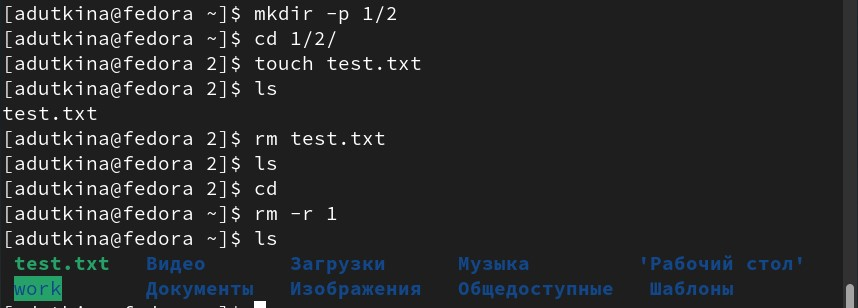{#fig:018 width=70%}

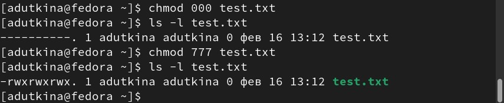{#fig:019 width=70%}

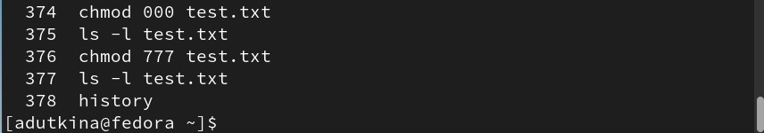{#fig:020 width=70%}

3. Файловая система - средство организации хранения файлов на каком-либо носителе. 

Примеры:

- NTFS (ОС "Windows") разрабатывалась с целью обеспечения скоростного выполнения стандартных операций над файлами (чтение, запись, поиск) и предоставления продвинутых возможностей включая восстановление повреждений файловой системы на больших дисках;
	
- Ext3 (ОС "Linux") соблюдает обычные стандарты для файловых систем UNIX-типа, является усовершенствованной файловой системой Ext2, предназначена для дальнейшего развития, сохраняя при этом хорошую производительность;

4. Для отображения файловых систем можно использовать findmnt, которая отображает целевую точку монтирования (TARGET), исходного устройство (SOURCE), тип файловой системы (FSTYPE) и соответствующие параметры монтирования (OPTIONS) для каждой файловой системы;

5. Удалить зависший процесс можно с помощью комбинации Ctrl+C (остановить процесс), Ctrl+Z (приостановить процесс).

# Выводы

В ходе лабораторной работы были приобретены практические навыки установки операционной системы на виртуальную машину, настройки минимально необходимых для дальнейшей работы сервисов.

