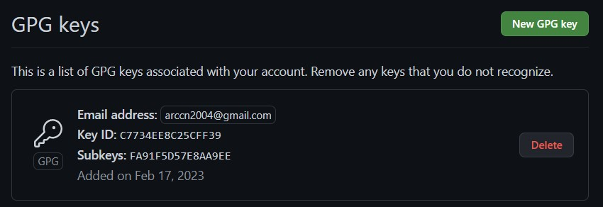

---
## Front matter
title: "Отчёта по лабораторной работе №2"
author: "Уткина Алина Дмитриевна"

## Generic otions
lang: ru-RU
toc-title: "Содержание"

## Bibliography
bibliography: bib/cite.bib
csl: pandoc/csl/gost-r-7-0-5-2008-numeric.csl

## Pdf output format
toc: true # Table of contents
toc-depth: 2
lof: true # List of figures
fontsize: 12pt
linestretch: 1.5
papersize: a4
documentclass: scrreprt
## I18n polyglossia
polyglossia-lang:
  name: russian
  options:
	- spelling=modern
	- babelshorthands=true
polyglossia-otherlangs:
  name: english
## I18n babel
babel-lang: russian
babel-otherlangs: english
## Fonts
mainfont: PT Serif
romanfont: PT Serif
sansfont: PT Sans
monofont: PT Mono
mainfontoptions: Ligatures=TeX
romanfontoptions: Ligatures=TeX
sansfontoptions: Ligatures=TeX,Scale=MatchLowercase
monofontoptions: Scale=MatchLowercase,Scale=0.9
## Biblatex
biblatex: true
biblio-style: "gost-numeric"
biblatexoptions:
  - parentracker=true
  - backend=biber
  - hyperref=auto
  - language=auto
  - autolang=other*
  - citestyle=gost-numeric
## Pandoc-crossref LaTeX customization
figureTitle: "Рис."
tableTitle: "Таблица"
listingTitle: "Листинг"
lofTitle: "Список иллюстраций"
lotTitle: "Список таблиц"
lolTitle: "Листинги"
## Misc options
indent: true
header-includes:
  - \usepackage{indentfirst}
  - \usepackage{float} # keep figures where there are in the text
  - \floatplacement{figure}{H} # keep figures where there are in the text
---

# Цель работы

Целью данной работы является изучеение идеологии и применение средств контроля версий, освоение умения по работе с git.

# Задание

- Создать базовую конфигурацию для работы с git.
- Создать ключ SSH.
- Создать ключ PGP.
- Настроить подписи git
- Зарегистрироваться на Github.
- Создать локальный каталог для выполнения заданий по предмету

# Выполнение лабораторной работы

## Установка программного обеспечения

Установим git (рис. @fig:001):

{#fig:001 width=70%}

Установим gh (рис. @fig:002):

{#fig:002 width=70%}

## Базовая настройка git

Зададим имя и email владельца репозитория, настроим utf-8 в выводе сообщений git, настроим верификацию и подписание коммитов git, зададим имя начальной ветки (будем называть её master) и установим параметры autocrlf и safecrlf (рис. @fig:003).

{#fig:003 width=70%}

## Создание ключей ssh

Создадим ключи ssh по алгоритму rsa с ключём размером 4096 бит (рис. @fig:004) и алгоритму ed25519 (рис. @fig:005).

{#fig:004 width=70%}

{#fig:005 width=70%}

## Создание ключей pgp

Генерируем ключ командой "gpg --full-generate-key", из предложенных опций выбираем: тип RSA and RSA, размер 4096 и  срок действия 0 (срок действия не истекает никогда). Зададим личную информацию, которая сохранится в ключе: имя, адрес электронной почты, используемый на GitHub (рис. @fig:006)

{#fig:006 width=70%}

## Настройка GitHub

Заходим в созданную учетную запись и проверяем основные данные

## Добавление PGP ключа в GitHub

Выводим список ключей и копируем отпечаток приватного ключа (рис. @fig:007).

{#fig:007 width=70%}

Отпечаток ключа — это последовательность байтов, используемая для идентификации более длинного, по сравнению с самим отпечатком ключа. Формат строки: 

- sec   Алгоритм/Отпечаток ключа, Дата создания [Флаги] [Годен_до]
- ID_ключа

Cкопируем сгенерированный PGP ключ в буфер обмена: gpg --armor --export C7734EE8C25CFF39 | xclip -sel clip. Перейдем в настройки GitHub и вставим полученный ключ в поле ввода (рис. @fig:008).

{#fig:008 width=70%}

## Настройка автоматических подписей коммитов git

Используя введёный email, укажем Git применять его при подписи коммитов (рис. @fig:009).

{#fig:009 width=70%}

## Настройка gh

Для начала войдем в аккаунт, ответив на несколько наводящих вопросов (рис. @fig:010).

{#fig:010 width=70%}

## Шаблон для рабочего пространства

Создадим репозиторий курса на основе шаблона, для этого создадим каталог ~/work/study/2022-2023/"Операционные системы", скачаем шаблон и клонируем его в каталог (рис. @fig:011).

{#fig:011 width=70%}

## Настройка каталога курса

Перейдем в каталог курса, удалим лишние файлы, созданим необходимые каталоги и отправим файлы на сервер (рис. @fig:012)

{#fig:012 width=70%}

## Ответы на контрольные вопросы

1. Системы контроля версий (VCS) разработаны специально для того, чтобы максимально упростить и упорядочить работу над проектом (вне зависимости от того, сколько человек в этом участвуют). СКВ дает возможность видеть, кто, когда и какие изменения вносил; позволяет формировать новые ветви проекта, объединять уже имеющиеся; настраивать контроль доступа к проекту; осуществлять откат до предыдущих версий.

2. Основные понятия:

- Хранилище (repository, сокр. repo), или репозитарий, — место хранения всех версий и служебной информации;
- Коммит (commit) — 1) синоним версии; 2) создание новой версии («сделать коммит», «закоммитить»);
- История разработки — совокупность всех версий файлов, над которыми ведется работа. Историей разработки в данном случае будет список изменений: создание файла, добавление изначального текста, исправление опечатки, добавление нового текста, объединение двух версий файла (при выполнении слияния);
- Рабочая копия (working copy или working tree) — текущее состояние файлов проекта, основанное на версии из хранилища (обычно на последней). 

3. Централизованные и децентрализованные VCS:

- Централизованные VCS - одно основное хранилище всего проекта, где каждый пользователь копирует себе необходимые ему файлы из этого репозитория, изменяет и, затем, добавляет свои изменения обратно. Например Subversion, CVS, TFS, VAULT, AccuRev;

- Децентрализованные VCS - у каждого пользователя свой вариант (возможно не один) репозитория, присутствует возможность добавлять и забирать изменения из любого репозитория. Например Git, Mercurial, Bazaar.

4. Единоличная работа с хранилищем:
 
- работа в локальном репозитории;
- сохранение изменений и загрузка на серверов.

5. Работа с общим хранилищем VCS: 

- проверка обновлений;
- загрузка обновлений (при наличии);
- работа в локальном репозитории;
- создаются ветвления, если несколько пользователей работают над одним и тем же файлом/документом;
- по результатам различных версий могут происходить слияния в одну ветвь.

6. Основные задачи, решаемые инструментальным средством git:

- хранить информацию о всех изменениях в коде;
- обеспечение удобства командной работы над кодом.

7. Примеры команд git:

- git pull - получение обновлений (изменений) текущего дерева из центрального репозитория;
- git push - отправка всех произведённых изменений локального дерева в центральный репозиторий;
- git status - просмотр списка изменённых файлов в текущей директории;
- git add - добавить все изменённые и/или созданные файлы и/или каталоги;
- git commit -am 'Описание коммита' - сохранить все добавленные изменения и все изменённые файлы.
 
8. 

(рис. @fig:0)

{#fig:0 width=70%}

# Выводы

Здесь кратко описываются итоги проделанной работы.

# Список литературы{.unnumbered}

::: {#refs}
:::
