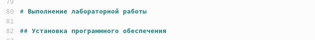
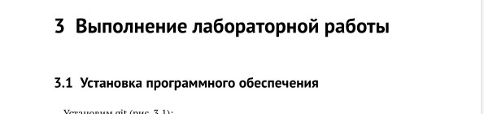
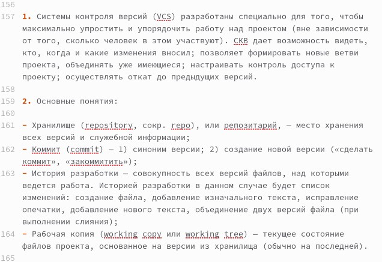
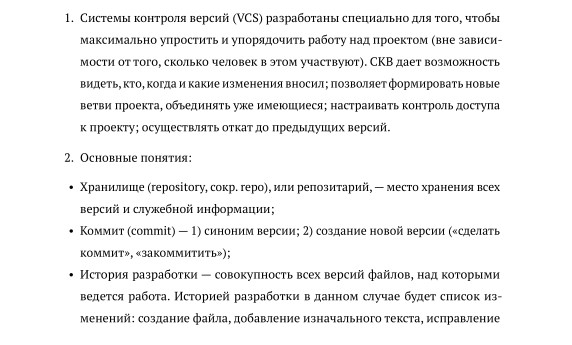
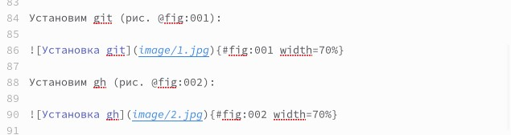
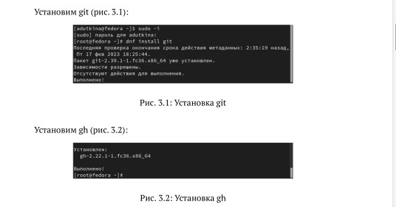
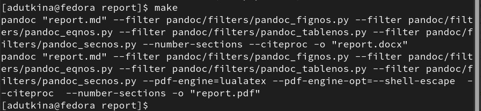
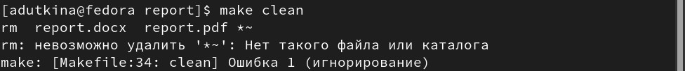

---
## Front matter
lang: ru-RU
title: Лабораторная работа №3 
subtitle: Markdown
author:
  - Уткина А.Д.
institute:
  - НПИбд-02-22
  - Российский университет дружбы народов, Москва, Россия
date: 25 февраля 2023

## i18n babel
babel-lang: russian
babel-otherlangs: english

## Formatting pdf
toc: false
toc-title: Содержание
slide_level: 2
aspectratio: 169
section-titles: true
theme: metropolis
header-includes:
 - \metroset{progressbar=frametitle,sectionpage=progressbar,numbering=fraction}
 - '\makeatletter'
 - '\beamer@ignorenonframefalse'
 - '\makeatother'
---

# Информация

## Докладчик

:::::::::::::: {.columns align=center}
::: {.column width="70%"}

  * Уткина Алина Дмитриевна
  * студент НПИбд-02-22
  * Российский университет дружбы народов
  
:::
::: {.column width="30%"}

:::
::::::::::::::

# Вводная часть

## Цель работы и задание

Целью данной работы является приобретение навыков оформления отчётов с помощью легковесного языка разметки Markdown.

Необходимо сделать отчёт по лабораторной работе №2 в формате Markdown.

# Выполнение лабораторной работы

## Создание заголовков

{#fig:001 width=70%}

{#fig:002 width=70%}

## Создание неупорядоченных и упорядоченных списков

:::::::::::::: {.columns align=center}
::: {.column width="50%"}

:::
::: {.column width="50%"}

:::
::::::::::::::

## Создание изображения 

:::::::::::::: {.columns align=center}
::: {.column width="50%"}

:::
::: {.column width="50%"}

:::
::::::::::::::

## Окончание работы, создание дополнительных форматов отчета

{#fig:007 width=70%}

{#fig:008 width=70%}

# Результаты

## Вывод

В ходе данной лабораторной работы были приобретены навыки оформления отчётов с помощью легковесного языка разметки Markdown. 
