---
## Front matter
title: "Отчёт по лабораторной работе №4"
author: "Уткина Алина Дмитриевна"

## Generic otions
lang: ru-RU
toc-title: "Содержание"

## Bibliography
bibliography: bib/cite.bib
csl: pandoc/csl/gost-r-7-0-5-2008-numeric.csl

## Pdf output format
toc: true # Table of contents
toc-depth: 2
lof: true # List of figures
fontsize: 12pt
linestretch: 1.5
papersize: a4
documentclass: scrreprt
## I18n polyglossia
polyglossia-lang:
  name: russian
  options:
	- spelling=modern
	- babelshorthands=true
polyglossia-otherlangs:
  name: english
## I18n babel
babel-lang: russian
babel-otherlangs: english
## Fonts
mainfont: PT Serif
romanfont: PT Serif
sansfont: PT Sans
monofont: PT Mono
mainfontoptions: Ligatures=TeX
romanfontoptions: Ligatures=TeX
sansfontoptions: Ligatures=TeX,Scale=MatchLowercase
monofontoptions: Scale=MatchLowercase,Scale=0.9
## Biblatex
biblatex: true
biblio-style: "gost-numeric"
biblatexoptions:
  - parentracker=true
  - backend=biber
  - hyperref=auto
  - language=auto
  - autolang=other*
  - citestyle=gost-numeric
## Pandoc-crossref LaTeX customization
figureTitle: "Рис."
tableTitle: "Таблица"
listingTitle: "Листинг"
lofTitle: "Список иллюстраций"
lotTitle: "Список таблиц"
lolTitle: "Листинги"
## Misc options
indent: true
header-includes:
  - \usepackage{indentfirst}
  - \usepackage{float} # keep figures where there are in the text
  - \floatplacement{figure}{H} # keep figures where there are in the text
---

# Цель работы

Приобретение практических навыков взаимодействия пользователя с системой посредством командной строки.

# Задание

Выполнить работу с основными командами

# Выполнение лабораторной работы

1. Определим полное имя домашнего каталога (рис. @fig:001).

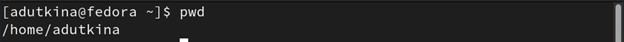{#fig:001 width=70%}

2. Выполним следующие действия:

- Перейдите в каталог /tmp, выведем на экран содержимое каталога /tmp. Для этого используем команду ls с различными опциями: отображение имен скрытых файлов(рис. @fig:002), вывод подробной информации (рис. @fig:003), получение информации о типах файлов (каталог "/", исполняемый файл "*", ссылка "@") (рис. @fig:004);

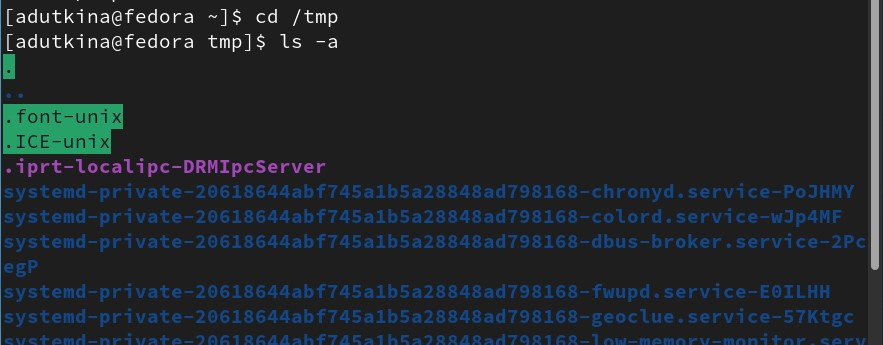{#fig:002 width=70%}

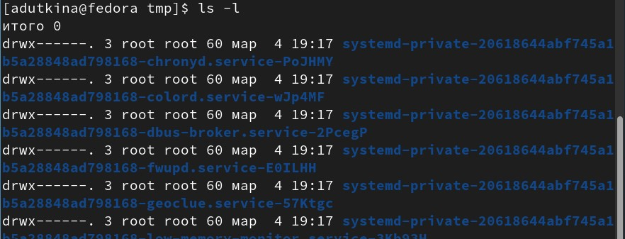{#fig:003 width=70%}

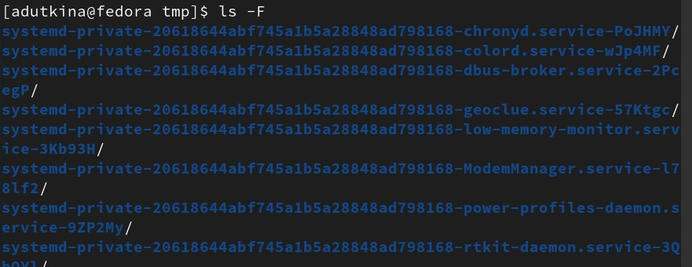{#fig:004 width=70%}

- Определим, есть ли в каталоге /var/spool подкаталог с именем cron (рис. @fig:005);

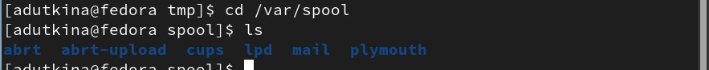{#fig:005 width=70%}

- Перейдите в домашний каталог и выведите на экран его содержимое. Определим, кто является владельцем файлов и подкаталогов (рис. @fig:006);

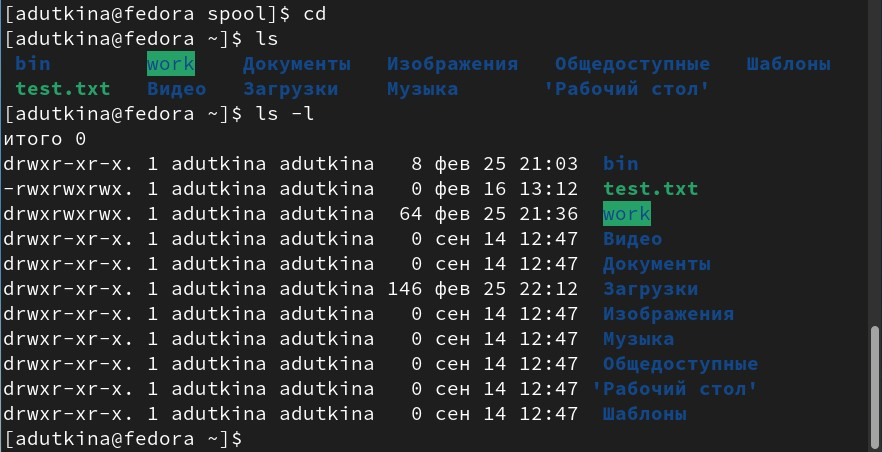{#fig:006 width=70%}

3. Выполним следующие действия:

- В домашнем каталоге создадим новый каталог с именем newdir, и в нем создадим каталог с именем morefun (рис. @fig:007) в команде мы используем опцию -p для создания промежуточных каталогов (родительских);

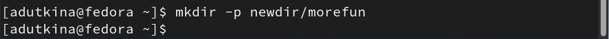{#fig:007 width=70%}

- В домашнем каталоге создадим одной командой три новых каталога с именами letters, memos, misk, затем удалим эти каталоги одной командой (рис. @fig:008).

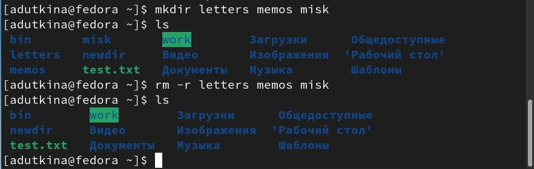{#fig:008 width=70%}

- Попробуем удалить ранее созданный каталог ~/newdir командой rm. Мы видим, что выдается ошибка, так как это каталог и его нужно удалять рекурсивно (опция -r), удалим каталог ~/newdir/morefun из домашнего каталога (рис. @fig:009). Проверим, был ли каталог удалён.(рис. @fig:010).

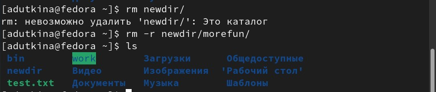{#fig:009 width=70%}

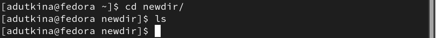{#fig:010 width=70%}

4. С помощью команды man определим, какую опцию команды ls нужно использовать для просмотра содержимого не только указанного каталога, но и подкаталогов, входящих в него (рис. @fig:011), (рис. @fig:012)

{#fig:011 width=70%}

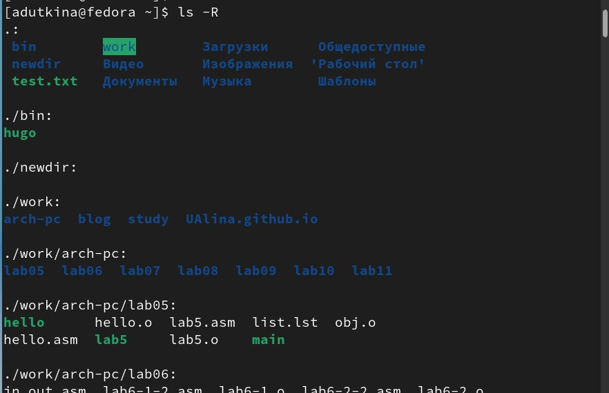{#fig:012 width=70%}

5. С помощью команды man определим набор опций команды ls, позволяющий отсортировать по времени последнего изменения выводимый список содержимого каталога с развёрнутым описанием файлов (рис. @fig:013), (рис. @fig:014)

{#fig:013 width=70%}

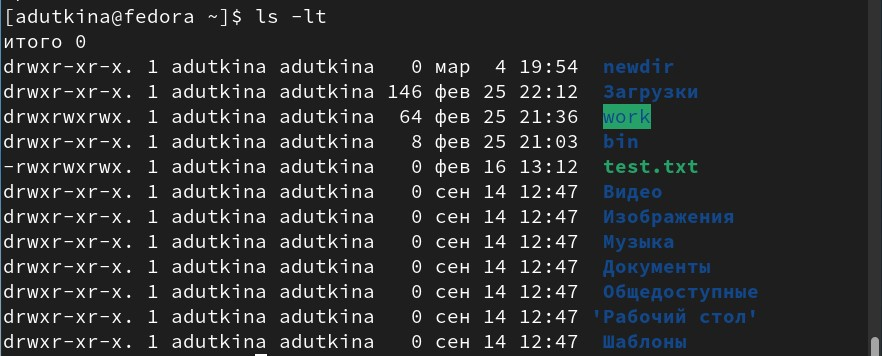{#fig:014 width=70%}

6. Используем команду man для просмотра описания следующих команд:
- cd (рис. @fig:015) 

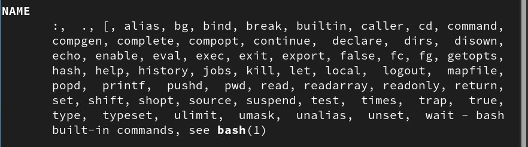{#fig:015 width=70%}

- pwd (рис. @fig:016)

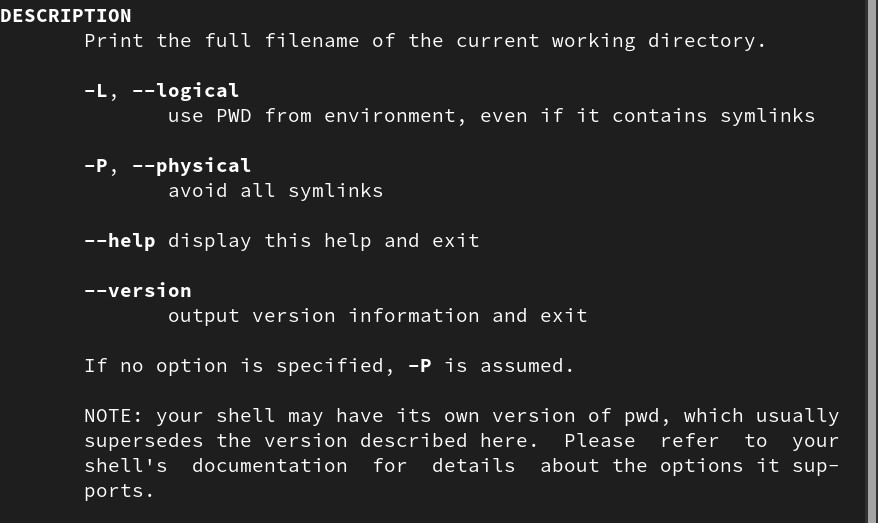{#fig:016 width=70%}

- mkmdir (рис. @fig:017)

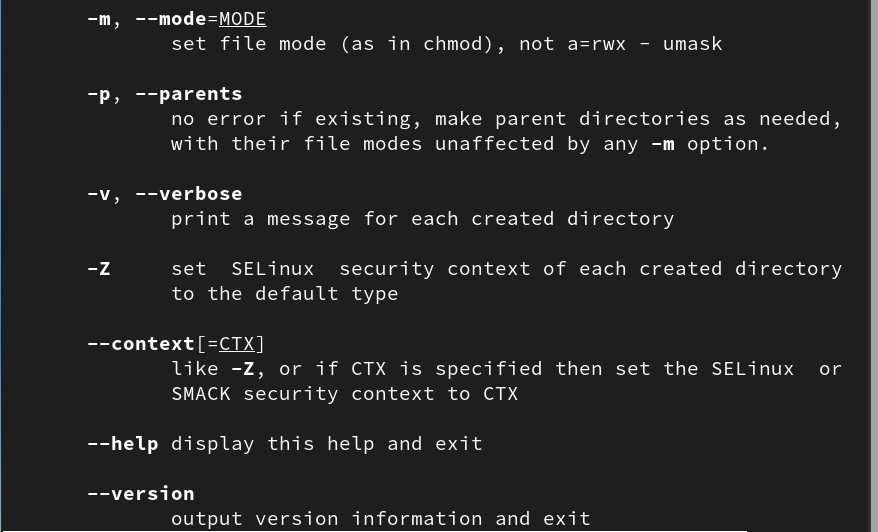{#fig:017 width=70%}

- rmdir (рис. @fig:018)

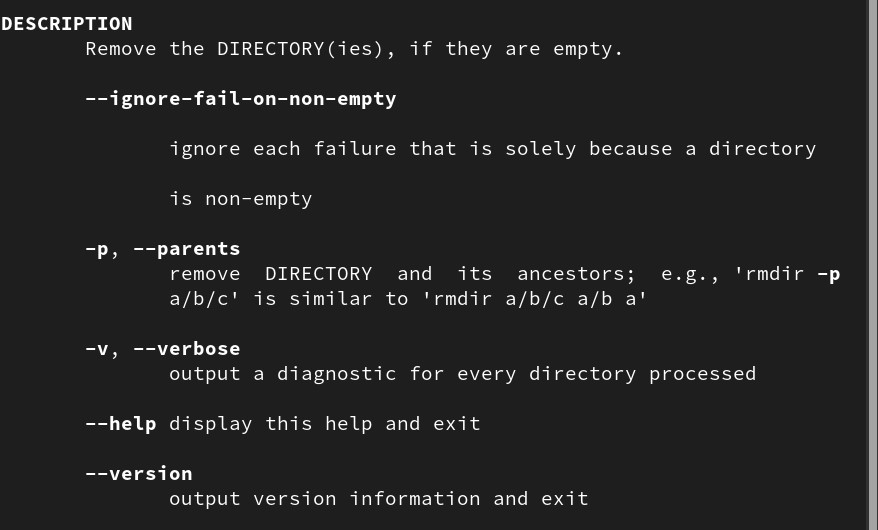{#fig:018 width=70%}

- rm (рис. @fig:019)

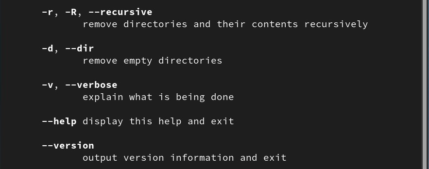{#fig:019 width=70%}

7. Используя информацию, полученную при помощи команды history, выполним модификацию и исполнение нескольких команд из буфера команд (рис. @fig:020)

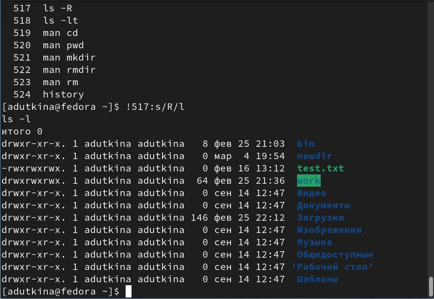{#fig:020 width=70%}

# Выводы

В ходе лабораторной работы была произведена работа с основными комндами и приобретены практические навыки взаимодействия пользователя с системой посредством командной строки.

