---
## Front matter
title: "Отчёт по лабораторной работе №5"
author: "Уткина Алина Дмитриевна"

## Generic otions
lang: ru-RU
toc-title: "Содержание"

## Bibliography
bibliography: bib/cite.bib
csl: pandoc/csl/gost-r-7-0-5-2008-numeric.csl

## Pdf output format
toc: true # Table of contents
toc-depth: 2
lof: true # List of figures
fontsize: 12pt
linestretch: 1.5
papersize: a4
documentclass: scrreprt
## I18n polyglossia
polyglossia-lang:
  name: russian
  options:
	- spelling=modern
	- babelshorthands=true
polyglossia-otherlangs:
  name: english
## I18n babel
babel-lang: russian
babel-otherlangs: english
## Fonts
mainfont: PT Serif
romanfont: PT Serif
sansfont: PT Sans
monofont: PT Mono
mainfontoptions: Ligatures=TeX
romanfontoptions: Ligatures=TeX
sansfontoptions: Ligatures=TeX,Scale=MatchLowercase
monofontoptions: Scale=MatchLowercase,Scale=0.9
## Biblatex
biblatex: true
biblio-style: "gost-numeric"
biblatexoptions:
  - parentracker=true
  - backend=biber
  - hyperref=auto
  - language=auto
  - autolang=other*
  - citestyle=gost-numeric
## Pandoc-crossref LaTeX customization
figureTitle: "Рис."
tableTitle: "Таблица"
listingTitle: "Листинг"
lofTitle: "Список иллюстраций"
lotTitle: "Список таблиц"
lolTitle: "Листинги"
## Misc options
indent: true
header-includes:
  - \usepackage{indentfirst}
  - \usepackage{float} # keep figures where there are in the text
  - \floatplacement{figure}{H} # keep figures where there are in the text
---

# Цель работы

Целью данной работы является ознакомление с файловой системой Linux, её структурой, именами и содержанием каталогов, приобретение практических навыков по применению команд для работы с файлами и каталогами, по управлению процессами (и работами), по проверке использования диска и обслуживанию файловой системы.

# Выполнение лабораторной работы

1. Выполним все примеры, приведённые в первой части описания лабораторной работы.

- Для создания текстового файла можно использовать команду touch (рис. @fig:001).

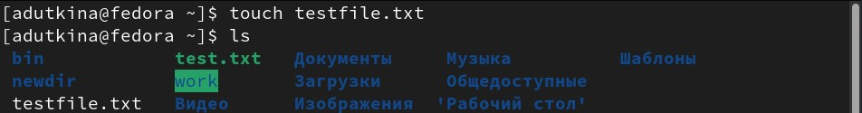{#fig:001 width=70%}

- Для просмотра файлов небольшого размера можно использовать команду cat (рис. @fig:002).

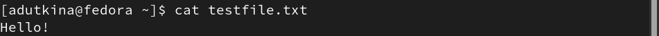{#fig:002 width=70%}

- Для просмотра файлов постранично можно использовать команду less (рис. @fig:003). Для управления процессом просмотра используются различные клавиши (Space — переход к следующей странице, ENTER — сдвиг вперёд на одну строку, b — возврат на предыдущую страницу, h — обращение за подсказкой, q — выход из режима просмотра файла).

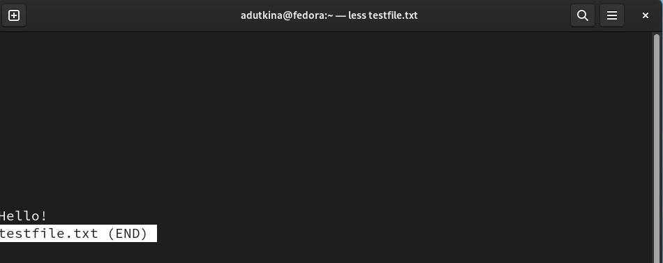{#fig:003 width=70%}

- Команда head выводит по умолчанию первые 10 строк файла (рис. @fig:004).

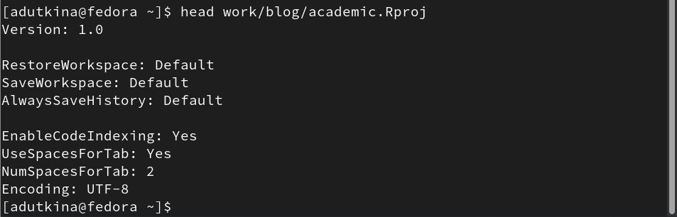{#fig:004 width=70%}

- Команда tail выводит умолчанию 10 последних строк файла (рис. @fig:005).

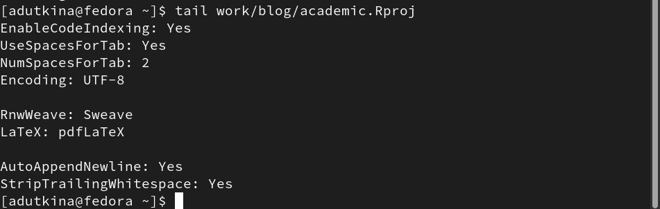{#fig:005 width=70%}

2. Выполним следующие действия:

- Скопируем файл /usr/include/sys/io.h в домашний каталог и назовем его equipment, проверим правильность выполнения команды (рис. @fig:006).

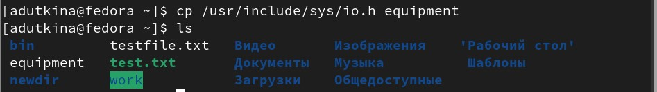{#fig:006 width=70%}

- В домашнем каталоге создадим директорию ~/ski.plases и переместите файл equipment в него (рис. @fig:007).

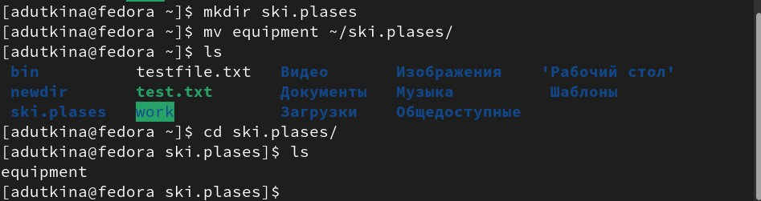{#fig:007 width=70%}

- Переименуем файл ~/ski.plases/equipment в ~/ski.plases/equiplist с помощью команды перемещения mv, обозначая то же расположение, но другое имя (рис. @fig:008).

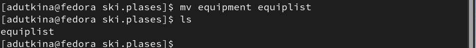{#fig:008 width=70%}

- Создадим в домашнем каталоге файл abc1 и скопируйте его в каталог ~/ski.plases, назовите его equiplist2 (рис. @fig:009).

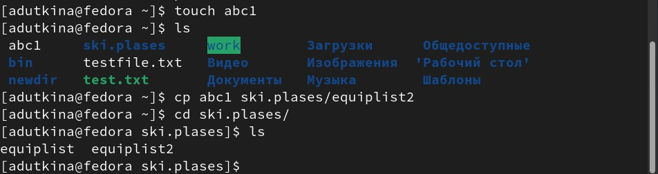{#fig:009 width=70%}

- Создадим каталог с именем equipment в каталоге ~/ski.plases и переместим файлы ~/ski.plases/equiplist и equiplist2 в него (рис. @fig:010).

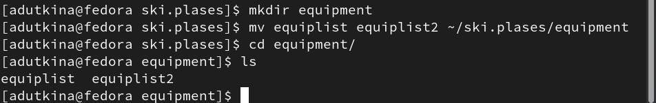{#fig:010 width=70%}

- Переместим каталог ~/newdir в каталог ~/ski.plases и назовем его plans (рис. @fig:011).

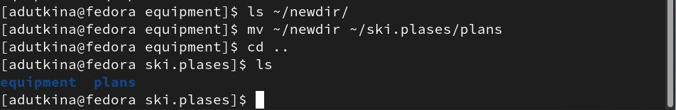{#fig:011 width=70%}

3. Определим опции команды chmod, необходимые для того, чтобы присвоить перечисленным ниже файлам выделенные права доступа, считая, что в начале таких прав нет:

- drwxr--r-- ... australia (111 100 100 --> 744)
- drwx--x--x ... play (111 001 001 --> 711)
- -r-xr--r-- ... my_os (101 100 100 --> 544) 
- -rw-rw-r-- ... feathers (110 110 100 --> 664)

"d" в записи - обозначение каталога, "-" - файл. Права доступа можно описать двоичной записью (1 - есть право, 0 - нет). Затем переводим полученные значения в восьмиричную запись. Проверим правильность выполнения задания, создав нужные файлы, зададим им права доступа в соответствии с вычислениями (рис. @fig:012). При выводе информации о файлах, видно, что заданные права совпадают с условием.

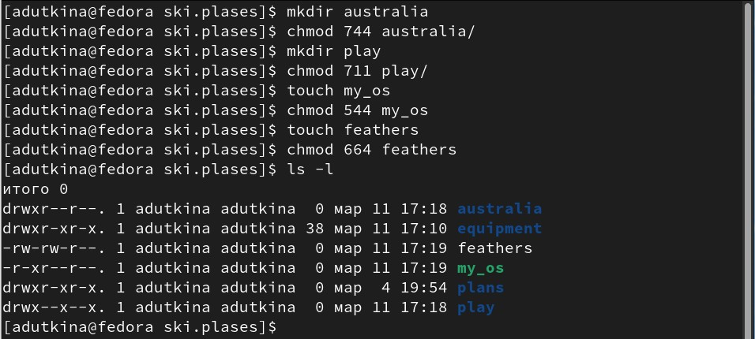{#fig:012 width=70%}

4. Проделаем приведённые ниже упражнения:

- Просмотрим содержимое файла /etc/password. В каталоге не нашлось такого файла, поэтому командой ls найдем, чем можно заменить его (рис. @fig:013), (рис. @fig:014), (рис. @fig:015).

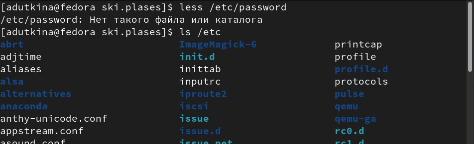{#fig:013 width=70%}

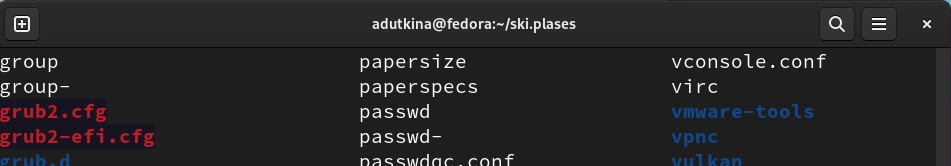{#fig:014 width=70%}

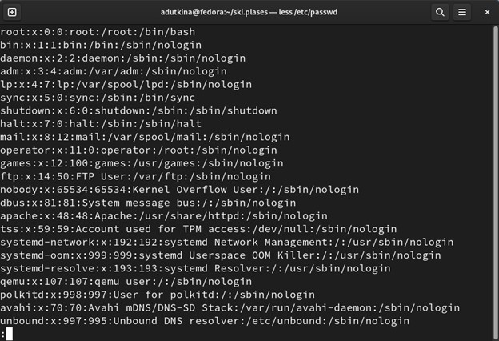{#fig:015 width=70%}

- Скопируем файл ~/feathers в файл ~/file.old (рис. @fig:016).

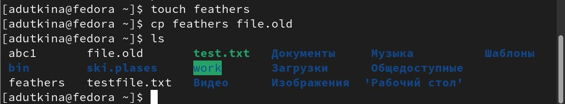{#fig:016 width=70%}

- Переместим файл ~/file.old в каталог ~/play (рис. @fig:017).

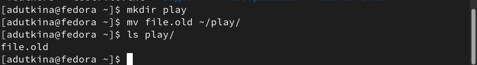{#fig:017 width=70%}

- Скопируем каталог ~/play в каталог ~/fun (рис. @fig:018).

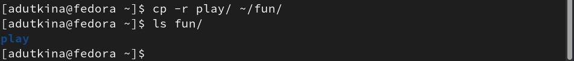{#fig:018 width=70%}

- Переместим каталог ~/fun в каталог ~/play и назовем его games (рис. @fig:019).

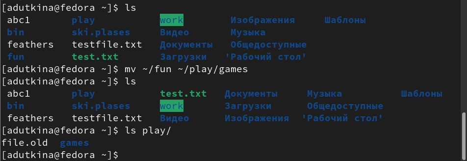{#fig:019 width=70%}

- Лишим владельца файла ~/feathers права на чтение (рис. @fig:020).

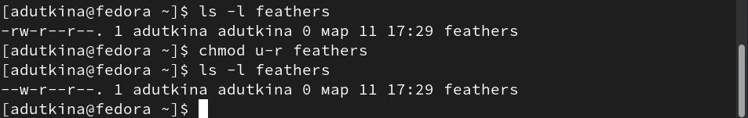{#fig:020 width=70%}

- При попытке просмотреть файл командой cat или скопировать, появляется ошибка (рис. @fig:021).

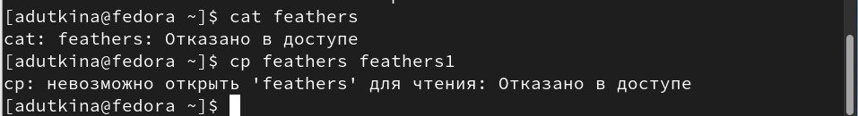{#fig:021 width=70%}

- Зададим владельцу файла ~/feathers право на чтение (рис. @fig:022).

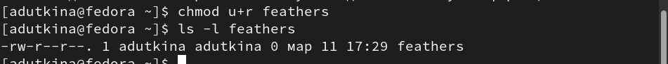{#fig:022 width=70%}

- Лишим владельца каталога ~/play права на выполнение (рис. @fig:023).

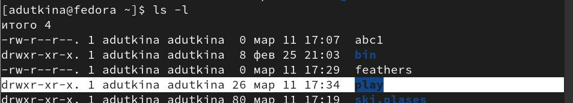{#fig:023 width=70%}

- Перейдем в каталог ~/play, выдается ошибка из-за ограничения прав доступа. Зададим владельцу каталога ~/play право на выполнение (рис. @fig:024).

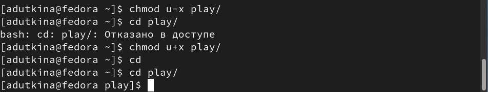{#fig:024 width=70%}

# Выводы

В ходе данной работы мы ознакомились с файловой системой Linux, её структурой, именами и содержанием каталогов, также были приобретены практические навыки по применению команд для работы с файлами и каталогами, по управлению процессами (и работами), по проверке использования диска и обслуживанию файловой системы.

