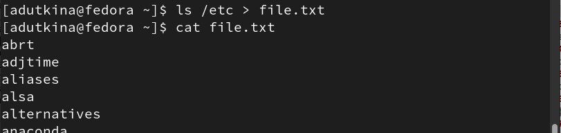
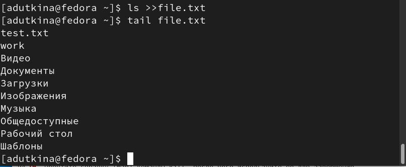
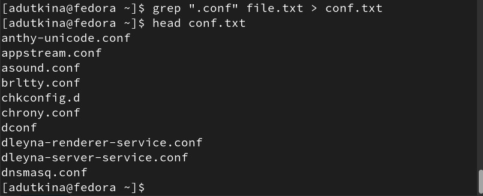
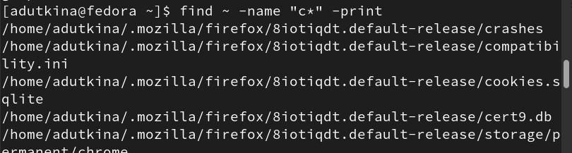
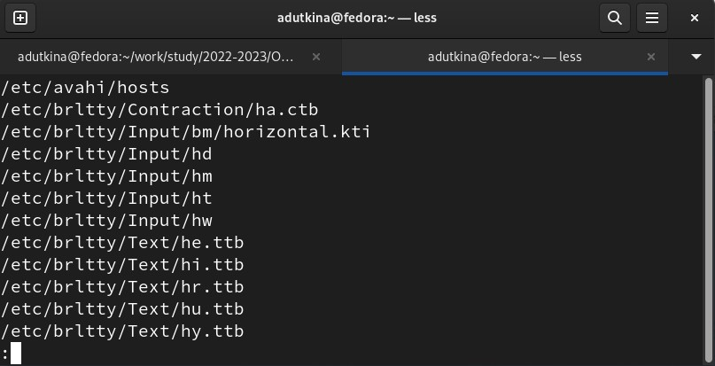
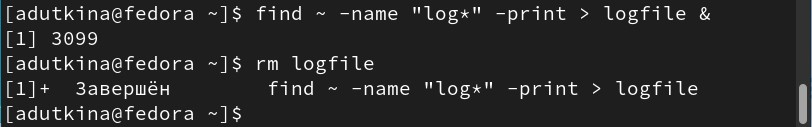
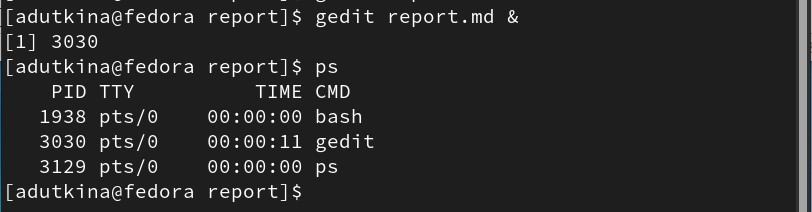
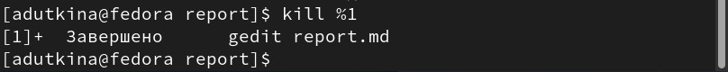
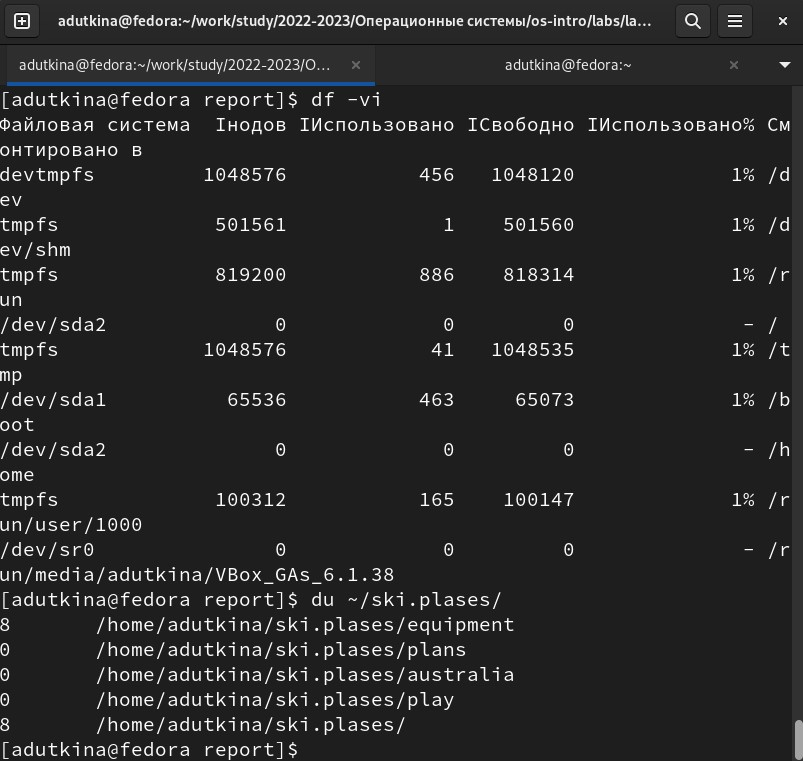
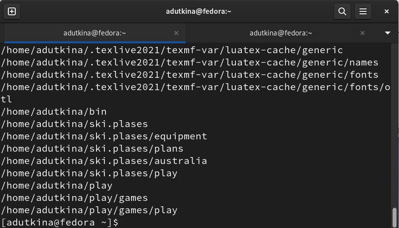

---
## Front matter
title: "Отчёт по лабораторной работе №6"
author: "Уткина Алина Дмитриевна"

## Generic otions
lang: ru-RU
toc-title: "Содержание"

## Bibliography
bibliography: bib/cite.bib
csl: pandoc/csl/gost-r-7-0-5-2008-numeric.csl

## Pdf output format
toc: true # Table of contents
toc-depth: 2
lof: true # List of figures
fontsize: 12pt
linestretch: 1.5
papersize: a4
documentclass: scrreprt
## I18n polyglossia
polyglossia-lang:
  name: russian
  options:
	- spelling=modern
	- babelshorthands=true
polyglossia-otherlangs:
  name: english
## I18n babel
babel-lang: russian
babel-otherlangs: english
## Fonts
mainfont: PT Serif
romanfont: PT Serif
sansfont: PT Sans
monofont: PT Mono
mainfontoptions: Ligatures=TeX
romanfontoptions: Ligatures=TeX
sansfontoptions: Ligatures=TeX,Scale=MatchLowercase
monofontoptions: Scale=MatchLowercase,Scale=0.9
## Biblatex
biblatex: true
biblio-style: "gost-numeric"
biblatexoptions:
  - parentracker=true
  - backend=biber
  - hyperref=auto
  - language=auto
  - autolang=other*
  - citestyle=gost-numeric
## Pandoc-crossref LaTeX customization
figureTitle: "Рис."
tableTitle: "Таблица"
listingTitle: "Листинг"
lofTitle: "Список иллюстраций"
lotTitle: "Список таблиц"
lolTitle: "Листинги"
## Misc options
indent: true
header-includes:
  - \usepackage{indentfirst}
  - \usepackage{float} # keep figures where there are in the text
  - \floatplacement{figure}{H} # keep figures where there are in the text
---

# Цель работы

Ознакомление с инструментами поиска файлов и фильтрации текстовых данных. Приобретение практических навыков: по управлению процессами (и заданиями), по проверке использования диска и обслуживанию файловых систем.

# Выполнение лабораторной работы

Осуществим вход в систему, используя соответствующее имя пользователя. Запишем в файл file.txt названия файлов, содержащихся в каталоге /etc (рис. @fig:001). Допишем в этот же файл названия файлов, содержащихся в домашнем каталоге (рис. @fig:002).

{#fig:001 width=70%}

{#fig:002 width=70%}

Выведем имена всех файлов из file.txt, имеющих расширение .conf, после чего запишем их в новый текстовой файл conf.txt (рис. @fig:003).

{#fig:003 width=70%}

Определим, какие файлы в домашнем каталоге имеют имена, начинавшиеся с символа "с" (рис. @fig:004).

{#fig:004 width=70%}

Выведем на экран (постранично) имена файлов из каталога /etc, начинающиеся с символа h (рис. @fig:005), (рис. @fig:006).

{#fig:005 width=70%}

{#fig:006 width=70%}

Запустим в фоновом режиме процесс, который будет записывать в файл ~/logfile файлы, имена которых начинаются с log и удалим файл (рис. @fig:007).

{#fig:007 width=70%}

Запустим из консоли в фоновом режиме редактор gedit и определим идентификатор процесса gedit, используя команду ps (рис. @fig:008). Завершим процесс командой kill (рис. @fig:009).

{#fig:008 width=70%}

{#fig:009 width=70%}

Выполним команды df и du, предварительно получив более подробную информацию об этих командах, с помощью команды man (рис. @fig:010).

{#fig:010 width=70%}

Воспользовавшись справкой команды find, выведем имена всех директорий, имеющихся в домашнем каталоге командой find ~ -type d (рис. @fig:011).

{#fig:011 width=70%}

# Выводы

В ходе работы мы ознакомились с инструментами поиска файлов и фильтрации текстовых данных, приобрели  практические навыки: по управлению процессами (и заданиями), по проверке использования диска и обслуживанию файловых систем.

