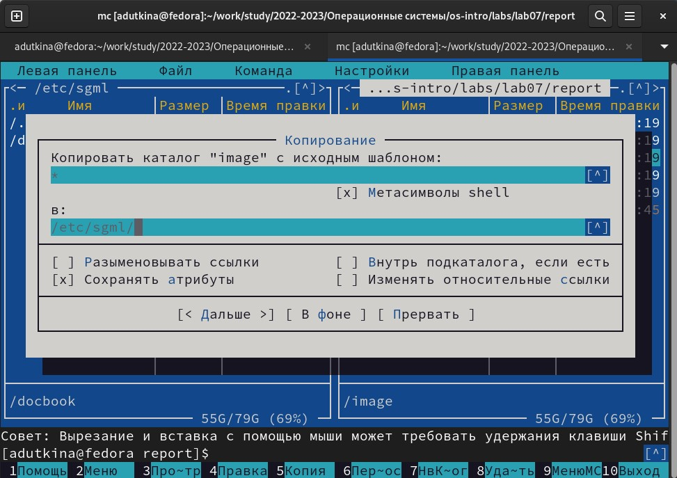
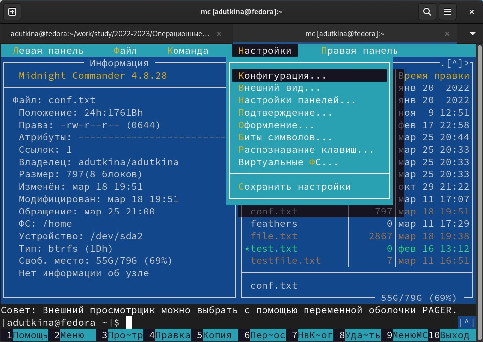

---
## Front matter
title: "Отчёт по лабораторной работе №7"
author: "Уткина Алина Дмитриевна"

## Generic otions
lang: ru-RU
toc-title: "Содержание"

## Bibliography
bibliography: bib/cite.bib
csl: pandoc/csl/gost-r-7-0-5-2008-numeric.csl

## Pdf output format
toc: true # Table of contents
toc-depth: 2
lof: true # List of figures
fontsize: 12pt
linestretch: 1.5
papersize: a4
documentclass: scrreprt
## I18n polyglossia
polyglossia-lang:
  name: russian
  options:
	- spelling=modern
	- babelshorthands=true
polyglossia-otherlangs:
  name: english
## I18n babel
babel-lang: russian
babel-otherlangs: english
## Fonts
mainfont: PT Serif
romanfont: PT Serif
sansfont: PT Sans
monofont: PT Mono
mainfontoptions: Ligatures=TeX
romanfontoptions: Ligatures=TeX
sansfontoptions: Ligatures=TeX,Scale=MatchLowercase
monofontoptions: Scale=MatchLowercase,Scale=0.9
## Biblatex
biblatex: true
biblio-style: "gost-numeric"
biblatexoptions:
  - parentracker=true
  - backend=biber
  - hyperref=auto
  - language=auto
  - autolang=other*
  - citestyle=gost-numeric
## Pandoc-crossref LaTeX customization
figureTitle: "Рис."
tableTitle: "Таблица"
listingTitle: "Листинг"
lofTitle: "Список иллюстраций"
lotTitle: "Список таблиц"
lolTitle: "Листинги"
## Misc options
indent: true
header-includes:
  - \usepackage{indentfirst}
  - \usepackage{float} # keep figures where there are in the text
  - \floatplacement{figure}{H} # keep figures where there are in the text
---

# Цель работы

Освоение основных возможностей командной оболочки Midnight Commander. Приобретение навыков практической работы по просмотру каталогов и файлов; манипуляций с ними.

# Выполнение лабораторной работы

## Задание по mc

1. Изучим информацию о mc, вызвав в командной строке man mc (рис. @fig:001).

{#fig:001 width=70%}

2. Запустим из командной строки mc, изучите его структуру и меню (рис. @fig:002).

{#fig:002 width=70%}

3. Выполним несколько операций в mc, используя управляющие клавиши F5 и F6 - копирование/перемещение файлов (рис. @fig:003), (рис. @fig:004).

{#fig:003 width=70%}

{#fig:004 width=70%}

4. Выполним основные команды меню левой панели - вывод информации о файле (рис. @fig:005).

{#fig:005 width=70%}

5. Используя возможности подменю Файл (рис. @fig:006), выполним:

- просмотр содержимого текстового файла; 

- редактирование содержимого текстового файла (без сохранения результатов редактирования) 

- создание каталога;

- копирование в файлов в созданный каталог.

{#fig:006 width=70%}

6. С помощью соответствующих средств подменю Команда (рис. @fig:007) осуществим:

- поиск в файловой системе файла с заданными условиями (например, файла с расширением .c или .cpp, содержащего строку main);

- выбор и повторение одной из предыдущих команд;

- переход в домашний каталог;

- анализ файла меню и файла расширений.

{#fig:007 width=70%}

7. Вызовем подменю Настройки (рис. @fig:008). Освоим операции, определяющие структуру экрана mc (Full screen, Double Width, Show Hidden Files и т.д.)ю

{#fig:008 width=70%}

## Задание по встроенному редактору mc

Создадим текстовой файл text.txt, откроем его с помощью встроенного в mc редактора и вставим в открытый файл небольшой фрагмент текста, скопированный из любого другого файла (рис. @fig:009).

{#fig:009 width=70%}

- удалим последнюю строку (ctrl-y);

- выделим фрагмент (f3) и скопируем его (f5), перенесем новый фрагмент (f6);

- сохраним файл;

- отменим последнее действие (ctrl-u);

- перейдем в конец файла (ctrl-end) и начало файла (ctrl-home) и напишем некоторый текст;

- сохраним и закроем файл.

(рис. @fig:010).

{#fig:010 width=70%}

Подсветку синтаксиса можно включить/выключить сочетанием ctrl-s.

# Выводы

В ходе работы были изучены основные возможности командной оболочки Midnight Commander, приобретены навыки практической работы по просмотру каталогов и файлов; манипуляций с ними.

