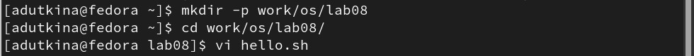
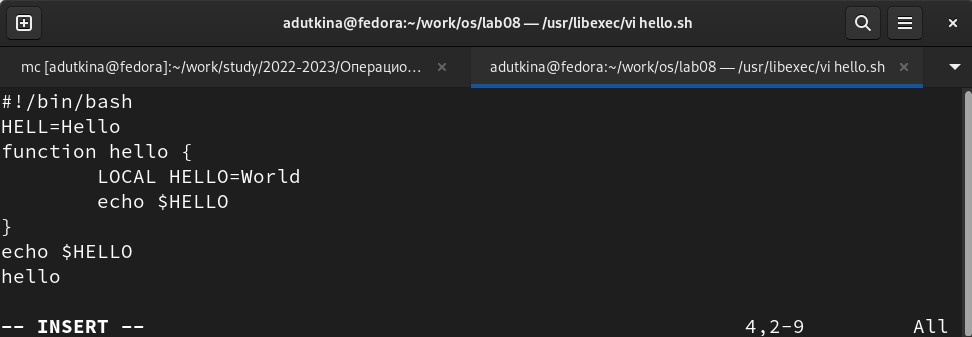
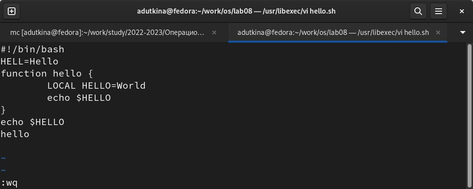
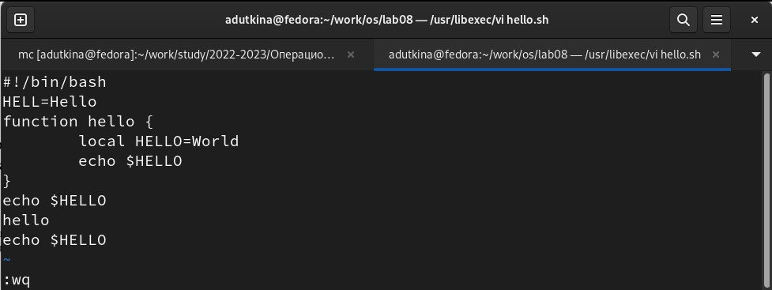

---
## Front matter
title: "Отчёт по лабораторной работе №8"
subtitle: "Текстовой редактор vi"
author: "Уткина Алина Дмитриевна"

## Generic otions
lang: ru-RU
toc-title: "Содержание"

## Bibliography
bibliography: bib/cite.bib
csl: pandoc/csl/gost-r-7-0-5-2008-numeric.csl

## Pdf output format
toc: true # Table of contents
toc-depth: 2
lof: true # List of figures
fontsize: 12pt
linestretch: 1.5
papersize: a4
documentclass: scrreprt
## I18n polyglossia
polyglossia-lang:
  name: russian
  options:
	- spelling=modern
	- babelshorthands=true
polyglossia-otherlangs:
  name: english
## I18n babel
babel-lang: russian
babel-otherlangs: english
## Fonts
mainfont: PT Serif
romanfont: PT Serif
sansfont: PT Sans
monofont: PT Mono
mainfontoptions: Ligatures=TeX
romanfontoptions: Ligatures=TeX
sansfontoptions: Ligatures=TeX,Scale=MatchLowercase
monofontoptions: Scale=MatchLowercase,Scale=0.9
## Biblatex
biblatex: true
biblio-style: "gost-numeric"
biblatexoptions:
  - parentracker=true
  - backend=biber
  - hyperref=auto
  - language=auto
  - autolang=other*
  - citestyle=gost-numeric
## Pandoc-crossref LaTeX customization
figureTitle: "Рис."
tableTitle: "Таблица"
listingTitle: "Листинг"
lofTitle: "Список иллюстраций"
lotTitle: "Список таблиц"
lolTitle: "Листинги"
## Misc options
indent: true
header-includes:
  - \usepackage{indentfirst}
  - \usepackage{float} # keep figures where there are in the text
  - \floatplacement{figure}{H} # keep figures where there are in the text
---

# Цель работы

Получить практические навыки работы с редактором vi, установленным по умолчанию практически во всех дистрибутивах.

# Выполнение лабораторной работы

## Создание нового файла с использованием vi

Создадим каталог с именем ~/work/os/lab08, перейдем в него. Вызовем vi и создадим файл hello.sh (рис. @fig:001).

{#fig:001 width=70%}

Нажмем клавишу i и введем следующий текст (рис. @fig:002).

{#fig:002 width=70%}

Нажмем клавишу Esc для перехода в командный режим после завершения ввода текста, нажмем : для перехода в режим последней строки, и внизу экрана появится приглашение в виде двоеточия. Нажмем w (записать) и q (выйти), а затем клавишу Enter для сохранения текста и завершения работы (рис. @fig:003).

{#fig:003 width=70%}

Сделаем файл исполняемым командой chmod +x hello.sh.

## Редактирование существующего файла

Вызовем vi на редактирование файла ~/work/os/lab08/hello.sh. 

Установим курсор в конец слова HELL второй строки. Перейдем в режим вставки и заменим на HELLO. Нажмем Esc для возврата в командный режим. Установим курсор на четвертую строку (4G) и сотрем слово LOCAL (dw). Перейдем в режим вставки и наберем следующий текст: local, нажмем Esc для возврата в командный режим. Установим курсор на последней строке файла. Вставим после неё строку, содержащую следующий текст: echo $HELLO. Нажмем Esc для перехода в командный режим. Удалим последнюю строку (d0). Введем команду отмены изменений u для отмены последней команды. Введем символ : для перехода в режим последней строки, запишем произведённые изменения и выйдем из vi (рис. @fig:004).

{#fig:004 width=70%}

# Выводы

В ходе лабораторной работы были получены практические навыки работы с редактором vi.

