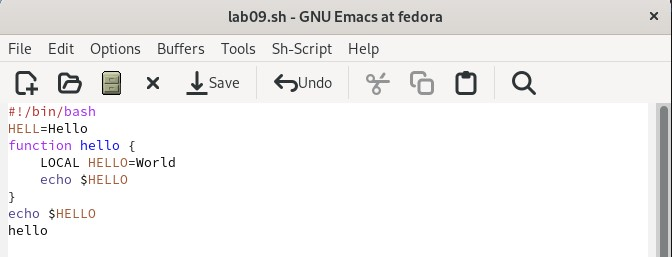
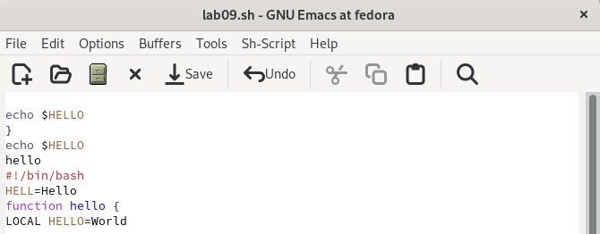
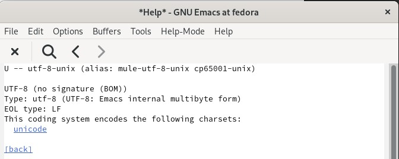
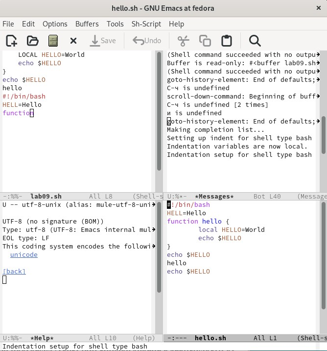

---
## Front matter
title: "Отчёт по лабораторной работе №9"
subtitle: "Текстовой редактор emacs"
author: "Уткина Алина Дмитриевна"

## Generic otions
lang: ru-RU
toc-title: "Содержание"

## Bibliography
bibliography: bib/cite.bib
csl: pandoc/csl/gost-r-7-0-5-2008-numeric.csl

## Pdf output format
toc: true # Table of contents
toc-depth: 2
lof: true # List of figures
fontsize: 12pt
linestretch: 1.5
papersize: a4
documentclass: scrreprt
## I18n polyglossia
polyglossia-lang:
  name: russian
  options:
	- spelling=modern
	- babelshorthands=true
polyglossia-otherlangs:
  name: english
## I18n babel
babel-lang: russian
babel-otherlangs: english
## Fonts
mainfont: PT Serif
romanfont: PT Serif
sansfont: PT Sans
monofont: PT Mono
mainfontoptions: Ligatures=TeX
romanfontoptions: Ligatures=TeX
sansfontoptions: Ligatures=TeX,Scale=MatchLowercase
monofontoptions: Scale=MatchLowercase,Scale=0.9
## Biblatex
biblatex: true
biblio-style: "gost-numeric"
biblatexoptions:
  - parentracker=true
  - backend=biber
  - hyperref=auto
  - language=auto
  - autolang=other*
  - citestyle=gost-numeric
## Pandoc-crossref LaTeX customization
figureTitle: "Рис."
tableTitle: "Таблица"
listingTitle: "Листинг"
lofTitle: "Список иллюстраций"
lotTitle: "Список таблиц"
lolTitle: "Листинги"
## Misc options
indent: true
header-includes:
  - \usepackage{indentfirst}
  - \usepackage{float} # keep figures where there are in the text
  - \floatplacement{figure}{H} # keep figures where there are in the text
---

# Цель работы

Целью данной работы является получение практических навыков работы с редактором Emacs.

# Выполнение лабораторной работы

## Основные команды emacs

Откроем emacs. Создадим файл lab09.sh с помощью комбинации Ctrl-x Ctrl-f (C-x C-f) и наберем текст (рис. @fig:001).

{#fig:001 width=70%}

Сохраним файл с помощью комбинации Ctrl-x Ctrl-s (C-x C-s).

Проделаем с текстом стандартные процедуры редактирования, где каждое действие осуществляется комбинацией клавиш (рис. @fig:002): 

- вырежем целую строку (С-k).
- вставим эту строку в конец файла (C-y).
- выделим область текста (C-space).
- скопируем область в буфер обмена (M-w).
- вставим область в конец файла.
- вновь выделим эту область и на этот раз вырежем её (C-w).
- отменим последнее действие (C-/).

{#fig:002 width=70%}

Научимся использовать команды по перемещению курсора:

- переместим курсор в начало строки (C-a).
- переместим курсор в конец строки (C-e).
- переместим курсор в начало буфера (M-<).
- переместим курсор в конец буфера (M->)

Управление буферами (рис. @fig:003):

- выведем список активных буферов на экран (C-x C-b).
- переместимся во вновь открытое окно (C-x) o со списком открытых буферов и переключимся на другой буфер.
- закроем это окно (C-x 0).
- теперь вновь переключимся между буферами, но уже без вывода их списка на экран (C-x b).

{#fig:003 width=70%}

Управление окнами (рис. @fig:004):

- поделим фрейм на 4 части: разделим фрейм на два окна по вертикали (C-x 3), а затем каждое из этих окон на две части по горизонтали (C-x 2).
- в каждом из четырёх созданных окон откроем новый буфер (файл) и введем несколько строк текста.

{#fig:004 width=70%}

Режим поиска: 

- переключимся в режим поиска (C-s) и найдем несколько слов, присутствующих в тексте.
- переключаться между результатами поиска можно сочетанием C-s.
- выйдем из режима поиска, нажав C-g.
- перейдем в режим поиска и замены (M-%), введем текст, который следует найти и заменить, нажмем Enter, затем введем текст для замены. После того как будут подсвечены результаты поиска, нажмем ! для подтверждения замены.
- испробуем другой режим поиска, нажав M-s o. 

# Выводы

В ходе работы были изучены команды редактора emacs и приобретены практические навыки работы с ними. 
