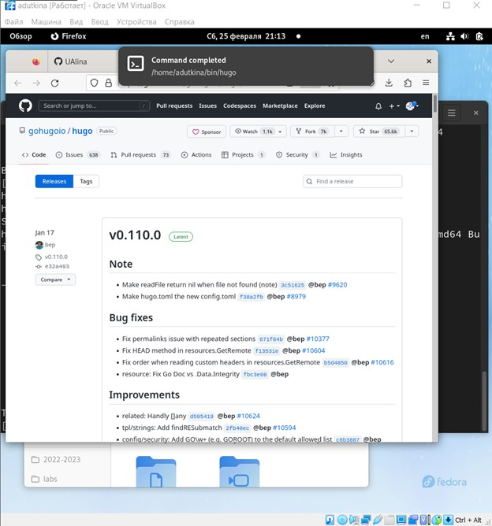

---
## Front matter
title: "Отчёт по первому этапу индивидуального проекта"
author: "Уткина Алина Дмитриевна"

## Generic otions
lang: ru-RU
toc-title: "Содержание"

## Bibliography
bibliography: bib/cite.bib
csl: pandoc/csl/gost-r-7-0-5-2008-numeric.csl

## Pdf output format
toc: true # Table of contents
toc-depth: 2
lof: true # List of figures
fontsize: 12pt
linestretch: 1.5
papersize: a4
documentclass: scrreprt
## I18n polyglossia
polyglossia-lang:
  name: russian
  options:
	- spelling=modern
	- babelshorthands=true
polyglossia-otherlangs:
  name: english
## I18n babel
babel-lang: russian
babel-otherlangs: english
## Fonts
mainfont: PT Serif
romanfont: PT Serif
sansfont: PT Sans
monofont: PT Mono
mainfontoptions: Ligatures=TeX
romanfontoptions: Ligatures=TeX
sansfontoptions: Ligatures=TeX,Scale=MatchLowercase
monofontoptions: Scale=MatchLowercase,Scale=0.9
## Biblatex
biblatex: true
biblio-style: "gost-numeric"
biblatexoptions:
  - parentracker=true
  - backend=biber
  - hyperref=auto
  - language=auto
  - autolang=other*
  - citestyle=gost-numeric
## Pandoc-crossref LaTeX customization
figureTitle: "Рис."
tableTitle: "Таблица"
listingTitle: "Листинг"
lofTitle: "Список иллюстраций"
lotTitle: "Список таблиц"
lolTitle: "Листинги"
## Misc options
indent: true
header-includes:
  - \usepackage{indentfirst}
  - \usepackage{float} # keep figures where there are in the text
  - \floatplacement{figure}{H} # keep figures where there are in the text
---

# Цель работы

Целью данной работы является приобретение умения работать с программным обеспечением для создания персонального сайта.

# Задание

- Установить необходимое программное обеспечение.
- Скачать шаблон темы сайта.
- Разместить его на хостинге git.
- Установить параметр для URLs сайта.
- Разместить заготовку сайта на Github pages.

# Выполнение лабораторной работы

1. Устанавливаем необходимое программное обеспечение. Для этого скачиваем архив с репозитория: https://github.com/gohugoio/hugo/releases. Нам нужна последняя версия, скачиваем файл hugo-extended_0.110.0_Linux-64bit.tar.gz (рис. @fig:001), (рис. @fig:002).

{#fig:001 width=70%}

{#fig:002 width=70%}

2. Из распакованного архива переносим исполняемый файл hugo в каталог bin, созданный в домашнем каталоге. Переходим в каталог work, куда клонируем репозиторий, созданнный на основе шаблона (рис. @fig:003).

{#fig:003 width=70%}

3. Устанавливаем go для дальнейшей работы (рис. @fig:004).

{#fig:004 width=70%}

4. В созданном каталоге запускаем исполняемый файл (рис. @fig:005).

{#fig:005 width=70%}

5. Запускаем команду для создания сайта и копируем полученную ссылку. У нас появляется макет сайта, с которым мы будем дальше работать (рис. @fig:006).

{#fig:006 width=70%}

6. В созданном каталоге должен был быть каталог home, из которого нужно удалить файл demo.md, но такого каталога там не оказалось (рис. @fig:007).

{#fig:007 width=70%}

7. Создаем еще один репозиторий с именем пользователя на GitHub. Клонируем репозиторий в папку work и создаем главную ветку (рис. @fig:008)

{#fig:008 width=70%}

8. Создаем пустой файл README.md, чтобы активировать созданный репозиторий, добавляем его на git (рис. @fig:009).

{#fig:009 width=70%}

9. Создаем каталог public и при работе с ним видим, что путь игнорируется (рис. @fig:010), чтобы это изменить редактируем файл .gitignore (рис. @fig:011). После этого мы можем создать файлы с помощью команды hugo.

{#fig:010 width=70%}

{#fig:011 width=70%}

10. Проверям главную ветку командой "git remote -v" (рис. @fig:012).

{#fig:012 width=70%}

11. После этого обновляем все файлы на git (рис. @fig:013).

{#fig:013 width=70%}

# Выводы

В ходе данной работы были приобретены умения работать с программным обеспечением для создания персонального сайта.

